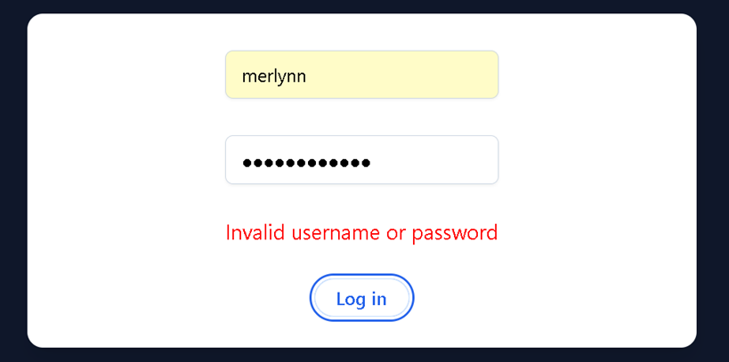
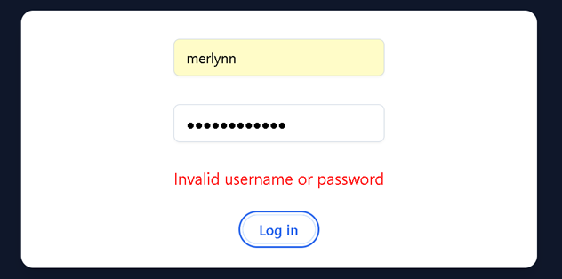

# How to set up and run the app:

1. Clone the repository using the following command: git clone https://github.com/dwaxgio/merlynn_tom_api.git.
2. Ensure that all dependencies are installed. You can execute the following command to install them: npm install.
3. Start the project by running the following command: npm start.
4. Once the project has started, you will see the login form. Please provide the following credentials:
   a. Username: merlynn
   b. Password: Merlynn123*

Note: In case the credentials are incorrect, please validate them as the app will display an alert:

5. After indicating the correct credentials and pressing the login button, the app will execute the first GET to the API to populate the form with:
   a. Model name
   b. Question labels
   c. Options
   d. Range/limits

Note: The form has validations to ensure that only input values corresponding to those accepted by the decision are registered, as shown below:

6. Fill in the fields with the requested data (according to the options provided if applicable or by entering the values manually):

7. Press the submit button:

Note: The form will show an alert if the validation of the indicated data represents an exception for the API, as shown below:

8. Once the data is submitted, the app will receive a response from the API indicating the decision to the user:

9. Press "Log Out" to return to the login form:

10. Additionally, you can follow the link to the GitHub repository indicated in the footer.

# Additions added:

1. Functionality to store data gathered from the TOM API: The application implements the useState hook to manage the data from the API, which contains the model information (attributes/metadata used to generate the form fields, options, limits, and types). The following useState hooks are used:
   • const [responseData, setResponseData] = useState(""): It contains the data retrieved from the API.
   • const [inputValues, setInputValues] = useState({}): It handles the data that the user indicates in the input.
   • const [decision, setDecision] = useState(""): It has the response received from the API containing the decision used to display the result on the screen.
   • const [error, setError] = useState(""): It saves the response from the decision in case the input values indicated by the user correspond to exceptions from the API.

2. Security considerations:
   • Validation for the input forms: The input forms are validated according to the documentation to control the data sent:

• Secure storage of API keys: The API key is stored securely in an environment variable or a configuration file, and it is not exposed in the code.
o A .env file was added to the project to store the key and URL:

Note: For the coding assessment, the values are indicated to set up the project, understanding that in a real scenario, this .env file and its corresponding values should not be exposed for security reasons.
• Login functionality added: In order to control only the registered user/password in the app (for assessment purposes, the credentials are hard-coded, understanding that in a production environment, they should be encrypted and handled differently).

# Bonus:

• The UI for the project was created using TailwindCSS.
